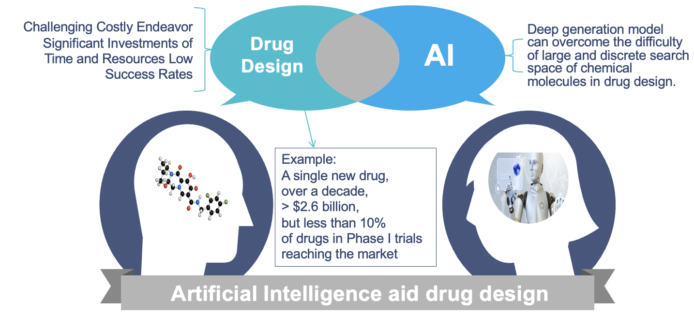

# Deep Generation Models for Drug Discovery

## Overview

Drug discovery is a challenging and costly endeavor, requiring significant investments of time and resources with low success rates. Deep generation models offer a promising new direction in pharmaceutical science by addressing the large and discrete search space of chemical molecules.

## Objectives

This project aims to:

- Summarize research on molecular generation.
- Describe the molecular graph generation task.
- Explore data resources and existing deep learning approaches.

## Contents

- **Molecular Graph Generation**: Understand how molecular graphs are generated and used in drug design.
- **Data Resources**: Review available datasets for training and evaluation.
- **Deep Learning Approaches**: Examine existing models and techniques applied to molecular generation.
